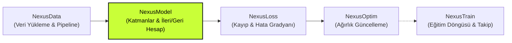

# ⚡ NexusModel

> **Yüksek Başarımlı C++20 Derin Öğrenme Katmanları, AVX2/AVX-512 SIMD & CUDA Hızlandırması, Açık Analitik Geri Yayılım.**

[](https://en.cppreference.com/w/cpp/20)
[](CMakeLists.txt)
[](#-donan%C4%B1m-h%C4%B1zland%C4%B1rmas%C4%B1-ve-teknik-altyap%C4%B1)
[](#-mimari-ve-autograd-yakla%C5%9F%C4%B1m%C4%B1-yol-b)
[](LICENSE)

<p align="center">
  
  
  
  
</p>

---

## 📌 Genel Bakış ve Proje Amacı

**NexusModel**, modern yapay zekâ ve derin öğrenme modellerinin inşası, ileri geçişi (**forward**) ve analitik geri yayılımı (**backward**) için sıfırdan C++20 standartlarıyla geliştirilmiş yüksek performanslı bir sinir ağı katman kütüphanesidir.

Büyük ve hantal derin öğrenme çerçevelerinin (framework) arkasında gizlenen karmaşık hesaplama grafikleri ve kontrolsüz bellek tahsisleri yerine; **şeffaf, ölçülebilir, deterministik ve donanımın sınırlarını zorlayan** bir mimari sunar.

### 🌟 Nexus Ekosistemindeki Yeri

Nexus ekosistemi, modern derin öğrenme iş akışını bağımsız ve modüler bileşenlere ayırır:



- **NexusData:** Veri kümelerini (Dataset), tensör dönüşümlerini ve çok iş parçacıklı DataLoader yapılarını sağlar.
- **NexusModel (Bu Kütüphane):** Ağırlıkları barındıran katmanları (Linear, Conv, Attention, Recurrent vb.), tensör işlemlerini ve modelin ileri/geri türev hesaplarını yönetir.
- **NexusLoss:** Analitik kayıp fonksiyonlarını (CrossEntropy, MSE vb.) çalıştırarak model çıktısına göre ilk gradyanı ($dL/d\hat{y}$) üretir.
- **NexusOptim:** Üretilen gradyanlarla parametreleri günceller (AdamW, SGD, RMSprop vb.).
- **MatrixFlash Pro:** Ham matris cebri ve GPU hızlandırma altyapısını sağlar.

---

## 🧭 İçindekiler

- [🎯 Ne İşe Yarar? (Özellikler)](#-ne-işe-yarar-özellikler)
- [⚙️ Donanım Hızlandırması ve Teknik Altyapı](#️-donanım-hızlandırması-ve-teknik-altyapı)
- [🧠 Mimari ve Autograd Yaklaşımı (Yol B)](#-mimari-ve-autograd-yaklaşımı-yol-b)
- [📦 Kurulum ve Derleme](#-kurulum-ve-derleme)
- [🚀 Hızlı Başlangıç ve Kullanım Örnekleri](#-hızlı-başlangıç-ve-kullanım-örnekleri)
  - [1. Basit İleri ve Geri Geçiş](#1-basit-ileri-ve-geri-geçiş)
  - [2. Sequential ile Çok Katmanlı Ağ (MLP)](#2-sequential-ile-çok-katmanlı-ağ-mlp)
  - [3. Evrişimli Sinir Ağı (CNN)](#3-evrişimli-sinir-ağı-cnn)
  - [4. Transformer ve Multi-Head Attention](#4-transformer-ve-multi-head-attention)
  - [5. Model Ağırlıklarını Kaydetme ve Yükleme](#5-model-ağırlıklarını-kaydetme-ve-yükleme)
  - [6. Nexus Ekosistemi ile Uçtan Uca Eğitim Döngüsü](#6-nexus-ekosistemi-ile-uçtan-uca-eğitim-döngüsü)
- [📊 Detaylı Benchmark ve Başarım Raporu](#-detaylı-benchmark-ve-başarım-raporu)
- [📚 Katman ve Modül Kataloğu](#-katman-ve-modül-kataloğu)
- [🗂️ Proje Dizin Yapısı](#️-proje-dizin-yapısı)
- [🤝 Katkıda Bulunma ve Lisans](#-katkıda-bulunma-ve-lisans)
- [🎓 Geliştirici ve İthaf](#-geliştirici-ve-ithaf)

---

## 🎯 Ne İşe Yarar? (Özellikler)

1. **Geniş Katman Ailesi:**
   - **Temel Katmanlar:** `Linear`, `Flatten`, `Reshape`, `ResidualBlock`.
   - **Evrişim (Convolution):** `Conv1D`, `Conv2D`, `Conv3D` (dilation, grouped/depthwise conv destekli).
   - **Havuzlama (Pooling):** `MaxPool2D`, `AvgPool2D`, `GlobalAvgPool2D`.
   - **Normalizasyon:** `LayerNorm`, `BatchNorm2D`, `GroupNorm`, `InstanceNorm`.
   - **Düzenlileştirme:** `Dropout` (eğitim ve çıkarım modları ayrılmış).
   - **Doğal Dil & Sıralı Modeller:** `Embedding`, `RNN`, `LSTM`, `GRU`.
   - **Modern Dikkat Mekanizmaları:** `MultiHeadAttention`, `PositionalEncoding`, `TransformerEncoderLayer`.

2. **Gelişmiş Aktivasyon Fonksiyonları:**
   - `ReLU`, `GELU` (tam ve tanh yaklaşımlı), `SiLU`, `Sigmoid`, `Tanh`, `Mish`, `ELU`, `LeakyReLU`, `Softmax`, `LogSoftmax`, `PReLU`.

3. **Sıfır Çalışma Zamanı Bellek Tahsisi (Zero-Allocation Hot Path):**
   - Isınmış bir modelde ardışık `forward` ve `backward` adımları sırasında dinamik yığın (`heap`) tahsisi yapılmaz (`allocation_count() == 0`). Önbellekler ve tensör tamponları katman bünyesinde yeniden kullanılır.

4. **Sıfır Harici Çalışma Zamanı Bağımlılığı (Zero External Runtime Dependency):**
   - Çekirdek kütüphane harici hiçbir 3. parti kütüphaneye bağlı değildir. Yalnızca standart C++20 kütüphanesini kullanır.

5. **Konteyner ve Model Yönetimi:**
   - `Sequential`, `ModuleList`, `ModuleDict` yapıları sayesinde PyTorch benzeri kolay model bloklama.
   - İkili biçimde hızlı parametre serileştirme (`save_state_dict`, `load_state_dict_file`).

---

## ⚙️ Donanım Hızlandırması ve Teknik Altyapı

NexusModel, modern işlemcilerin ve ekran kartlarının tüm vektörel imkânlarını kullanacak şekilde düşük seviyeli optimize edilmiştir:

| Teknoloji | Kullanım Alanı ve Detay |
|---|---|
| **C++20 Standartları** | `std::span`, konseptler, akıllı işaretçiler, RAII ve bellek güvenliği. |
| **AVX2 & FMA (CPU)** | **6×16 Register Tiling (12 FMA Akümülatörü):** Matris çarpımlarında (GEMM) yazmaç seviyesinde döngü açma.<br>**8 KiB Stack Weight Panel:** 128 derinlikli ağırlık bloklama ile L1 önbellek optimizasyonu.<br>**Transpose-free Backward:** Geri yayılımda matris transpozu oluşturmadan adımlı (stride) bellek erişimiyle $dX$ ve $dW$ hesabı. |
| **AVX-512 (CPU)** | Vektörize dot-product ve ReLU çekirdekleri (`NEXUS_MODEL_ENABLE_AVX512=ON`). |
| **Dinamik CPU Dispatcher** | Çalışma anında `CPUID` ve `XGETBV` kontrolleriyle işlemcinin AVX2/FMA/AVX-512 yeteneklerini doğrular; donanım desteği yoksa güvenli taşınabilir skaler çekirdeğe düşer (`scalar fallback`). |
| **CUDA & Fused Kernels (GPU)** | `NEXUS_MODEL_WITH_CUDA=ON` bayrağı ile derlenen Fused Softmax, Fused LayerNorm ve GPU aktivasyon çekirdekleri. |
| **MatrixFlash Pro Entegrasyonu** | `NEXUS_MODEL_WITH_MATRIXFLASH=ON` ile büyük matris çarpımlarında isteğe bağlı MatrixFlash Pro köprüsü. |

---

## 🧠 Mimari ve Autograd Yaklaşımı (Yol B)

Geleneksel autograd kütüphanelerinde (ör. PyTorch Autograd, TinyGrad) her tensör işlemi arkada devasa bir yönlü döngüsüz çizge (**DAG**) oluşturur. Bu durum derin katmanlarda ciddi bellek parçalanmasına, yığın tahsislerine ve belirsiz çalışma sürelerine yol açar.

**NexusModel, hibrit ve optimize edilmiş "Yol B" mimarisini kullanır:**

```text
               ┌────────────────────────────────────────────────────────┐
               │              Girdi Tensörü (Input Tensor)              │
               └──────────────────────────┬─────────────────────────────┘
                                          │
                                   forward(x)
                                          ▼
┌───────────────────────────────────────────────────────────────────────────────────────────┐
│ Modül Katmanları (Linear, Conv, Pooling, LayerNorm, RNN, LSTM, GRU, Aktivasyonlar)       │
│ ──> Analitik Açık Gradyan (Explicit Analytic Backward)                                     │
│     * dL/dX ve dL/dW katman bazında el yazımı SIMD matris türevleriyle hesaplanır.        │
│     * Katman tamponları yeniden kullanılır, dinamik çizge oluşturulmaz.                   │
└─────────────────────────────────────────┬─────────────────────────────────────────────────┘
                                          │
                                   forward(x)
                                          ▼
┌───────────────────────────────────────────────────────────────────────────────────────────┐
│ Dikkat ve Transformer Katmanları (Attention, MultiHeadAttention)                           │
│ ──> Katman İçi Mikro-Çizge (MicroTape Autograd)                                          │
│     * Softmax ve QK^T matris zinciri katmana özel hafif bir MicroTape ile türetilir.       │
│     * Stabil deque slotları sayesinde referans bozulması önlenir.                         │
└───────────────────────────────────────────────────────────────────────────────────────────┘
```

> [!NOTE]
> Bu sayede katmanlar arasındaki arayüz net, öngörülebilir ve son derece hızlıdır. `zero_grad()` ile parametre gradyanları sıfırlanır, `backward(grad_output)` ile girdi gradyanı (`grad_input`) geri döndürülürken parametre gradyanları akümüle edilir.

---

## 📦 Kurulum ve Derleme

### Gereksinimler

- **C++ Derleyicisi:** C++20 standardını destekleyen modern bir derleyici:
  - MSVC 19.30+ (Visual Studio 2022)
  - GCC 11+
  - Clang 13+
- **CMake:** 3.20 veya üzeri.
- *(İsteğe Bağlı)* **CUDA Toolkit 11.0+** (GPU çekirdekleri için).

### 1. Depoyu Derleme

```bash
# Projeyi klonlayın ve klasöre girin
git clone https://github.com/muhammedfatihsahin/nexus.git
cd nexus/lib/NexusModel

# CMake yapılandırması
cmake -S . -B build -DCMAKE_BUILD_TYPE=Release

# Derleme (Tüm çekirdeklerle)
cmake --build build --config Release --parallel

# Testleri koşturma
ctest --test-dir build -C Release --output-on-failure
```

### 2. CMake Konfigürasyon Seçenekleri

Derleme sürecini `CMakeLists.txt` içerisindeki bayraklarla özelleştirebilirsiniz:

| CMake Seçeneği | Varsayılan | Açıklama |
|---|:---:|---|
| `NEXUS_MODEL_BUILD_TESTS` | `ON` | Birim doğruluk ve gradyan kontrol testlerini derler (`nexus_model_tests`). |
| `NEXUS_MODEL_BUILD_BENCHMARKS` | `ON` | Çekirdek ve katman kıyaslama araçlarını derler (`nexus_model_bench`). |
| `NEXUS_MODEL_ENABLE_AVX512` | `ON` | AVX-512 destekli vektörel çekirdekleri etkinleştirir. |
| `NEXUS_MODEL_WITH_CUDA` | `OFF` | Fused CUDA Softmax ve LayerNorm GPU çekirdeklerini derler. |
| `NEXUS_MODEL_WITH_MATRIXFLASH`| `OFF` | Matris işlemlerini MatrixFlash Pro'ya yönlendirir. |
| `NEXUS_MODEL_BUILD_EXAMPLES` | `OFF` | NexusLoss, NexusOptim ve NexusData ile uçtan uca eğitim örneğini derler. |
| `NEXUS_MODEL_WARNINGS_AS_ERRORS`| `ON` | Derleyici uyarılarını hata (`/WX` veya `-Werror`) olarak kabul eder. |

### 3. Kendi Projenize Dahil Etme

#### Yöntem A: `add_subdirectory` ile

```cmake
# Ana projenizin CMakeLists.txt dosyasında:
add_subdirectory(path/to/NexusModel)
target_link_libraries(my_neural_app PRIVATE nexus_model::nexus_model)
```

#### Yöntem B: Header ve Kütüphane Yolu ile

```cmake
find_package(nexus_model REQUIRED) # veya manuel include:
target_include_directories(my_neural_app PRIVATE path/to/NexusModel/include)
target_link_libraries(my_neural_app PRIVATE path/to/nexus_model.lib)
```

---

## 🚀 Hızlı Başlangıç ve Kullanım Örnekleri

Tüm modelleri ve katmanları tek bir başlık dosyasıyla projenize ekleyebilirsiniz:

```cpp
#include <nexus_model/nexus_model.hpp>
```

### 1. Basit İleri ve Geri Geçiş

```cpp
#include <nexus_model/nexus_model.hpp>
#include <iostream>

using namespace nexus_model;

int main() {
    init::manual_seed(42);

    // 4 girdi, 2 çıktı ve bias içeren bir Linear katman
    Linear fc(4, 2, /*use_bias=*/true);

    // [Batch=2, Features=4] boyutunda girdi tensörü
    Tensor x = Tensor::from_values({2, 4}, {
        1.0f, 0.5f, -0.2f, 0.8f,
        0.0f, 1.2f,  0.3f, -0.5f
    });

    // İleri Geçiş (Forward Pass)
    Tensor y = fc.forward(x);
    std::cout << "Çıktı Şekli: [" << y.size(0) << ", " << y.size(1) << "]\n";

    // Geri Geçiş (Backward Pass)
    fc.zero_grad(); // Parametre gradyanlarını sıfırla
    Tensor grad_out = Tensor::full({2, 2}, 1.0f); // dL/dy
    Tensor grad_in = fc.backward(grad_out);        // dL/dx üretir

    // Ağırlık gradyanlarına erişim
    auto& weight_grad = fc.weight()->grad;
    std::cout << "Ağırlık gradyan eleman sayısı: " << weight_grad.numel() << "\n";
    return 0;
}
```

---

### 2. Sequential ile Çok Katmanlı Ağ (MLP)

```cpp
#include <nexus_model/nexus_model.hpp>
#include <iostream>
#include <memory>

using namespace nexus_model;

int main() {
    init::manual_seed(42);

    // Çok katmanlı algılayıcı (MLP) mimarisi
    auto model = Sequential({
        std::make_shared<Linear>(784, 256),
        std::make_shared<LayerNorm>(256),
        std::make_shared<GELU>(),
        std::make_shared<Dropout>(0.1f),
        std::make_shared<Linear>(256, 10),
        std::make_shared<Softmax>()
    });

    Tensor batch = Tensor::zeros({16, 784});
    batch.fill(0.25f);

    // İleri geçiş
    Tensor probas = model.forward(batch);
    std::cout << "Tahmin Tensörü: [" << probas.size(0) << ", " << probas.size(1) << "]\n";

    // Modelin tüm parametrelerini listeleme
    auto params = model.parameters();
    std::cout << "Toplam eğitilebilir parametre tensörü sayısı: " << params.size() << "\n";
    return 0;
}
```

---

### 3. Evrişimli Sinir Ağı (CNN)

Görüntü ve sinyal işleme için NCHW biçiminde evrişim ve havuzlama katmanları:

```cpp
#include <nexus_model/nexus_model.hpp>
#include <iostream>
#include <memory>

using namespace nexus_model;

int main() {
    auto cnn = Sequential({
        // [Batch, 3 kanal, 32x32] -> [Batch, 16 kanal, 32x32]
        std::make_shared<Conv2D>(/*in_channels=*/3, /*out_channels=*/16, /*kernel=*/3, /*stride=*/1, /*padding=*/1),
        std::make_shared<BatchNorm2D>(16),
        std::make_shared<ReLU>(),
        // [Batch, 16, 32x32] -> [Batch, 16, 16x16]
        std::make_shared<MaxPool2D>(/*kernel=*/2, /*stride=*/2),
        // Düzleştirme: [Batch, 16 * 16 * 16] = [Batch, 4096]
        std::make_shared<Flatten>(),
        std::make_shared<Linear>(4096, 10)
    });

    Tensor images = Tensor::zeros({4, 3, 32, 32});
    Tensor logits = cnn.forward(images);

    std::cout << "CNN Çıktı Boyutu: [" << logits.size(0) << ", " << logits.size(1) << "]\n";
    return 0;
}
```

---

### 4. Transformer ve Multi-Head Attention

Doğal dil işleme (NLP) ve sıralı veriler için çok başlıklı dikkat mekanizması:

```cpp
#include <nexus_model/nexus_model.hpp>
#include <iostream>

using namespace nexus_model;

int main() {
    const int embed_dim = 64;
    const int num_heads = 4;
    const int seq_len = 16;
    const int batch_size = 2;

    // Multi-Head Attention Katmanı (Causal Masking desteğiyle)
    MultiHeadAttention mha(embed_dim, num_heads, /*dropout=*/0.0f, /*causal=*/true);

    // Girdi tensörü: [Batch, SeqLen, EmbeddingDim]
    Tensor tokens = Tensor::zeros({batch_size, seq_len, embed_dim});
    tokens.fill(0.1f);

    // Attention İleri Geçişi
    Tensor context = mha.forward(tokens);
    std::cout << "Attention Çıktısı: [" << context.size(0) << ", " << context.size(1) << ", " << context.size(2) << "]\n";

    // Tam Transformer Encoder Katmanı (Post-LN mimarisi)
    TransformerEncoderLayer enc_layer(embed_dim, num_heads, /*dim_feedforward=*/128, /*dropout=*/0.1f);
    Tensor enc_out = enc_layer.forward(tokens);
    std::cout << "Encoder Katman Çıktısı: [" << enc_out.size(0) << ", " << enc_out.size(1) << "]\n";

    return 0;
}
```

---

### 5. Model Ağırlıklarını Kaydetme ve Yükleme

Ağ ağırlıklarını diskte binary formatta saklayabilir ve geri yükleyebilirsiniz:

```cpp
#include <nexus_model/nexus_model.hpp>
#include <iostream>

using namespace nexus_model;

int main() {
    auto model = Sequential({
        std::make_shared<Linear>(10, 5),
        std::make_shared<ReLU>(),
        std::make_shared<Linear>(5, 2)
    });

    // 1. Ağırlıkları StateDict formatına çıkar ve dosyaya kaydet
    StateDict state = model.state_dict();
    save_state_dict(state, "model_checkpoint.bin");
    std::cout << "Model disk üzerine kaydedildi.\n";

    // 2. Yeni bir model oluştur ve diskteki ağırlıkları yükle
    auto new_model = Sequential({
        std::make_shared<Linear>(10, 5),
        std::make_shared<ReLU>(),
        std::make_shared<Linear>(5, 2)
    });

    StateDict loaded_state = load_state_dict_file("model_checkpoint.bin");
    new_model.load_state_dict(loaded_state);
    std::cout << "Ağırlıklar başarıyla yüklendi ve doğrulandı!\n";

    return 0;
}
```

---

### 6. Nexus Ekosistemi ile Uçtan Uca Eğitim Döngüsü

NexusData, NexusModel, NexusLoss ve NexusOptim birlikte nasıl kusursuz çalışır?

```cpp
#include <nexus_model/nexus_model.hpp>
#include <nexus_model/adapters/nexus_optim.hpp>
#include <nexusdata/nexusdata.hpp>
#include <nexusloss/nexusloss.hpp>
#include <nexus_optim/algorithms/adamw.hpp>
#include <iostream>

int main() {
    // 1. Model Mimarisi (NexusModel)
    auto model = nexus_model::Sequential({
        std::make_shared<nexus_model::Linear>(8, 16),
        std::make_shared<nexus_model::ReLU>(),
        std::make_shared<nexus_model::Linear>(16, 3) // 3 sınıflı sınıflandırma
    });

    // 2. Kayıp Fonksiyonu (NexusLoss)
    nexusloss::classification::CrossEntropyLoss<float> loss_fn;

    // 3. Eniyileyici (NexusOptim)
    nexus_optim::AdamW<float>::Options opt_opts;
    opt_opts.lr = 1e-2f;
    nexus_optim::ParamGroupOptions grp_opts;
    grp_opts.learning_rate = 1e-2f;

    nexus_optim::AdamW<float> optimizer(
        {nexus_model::as_param_group(model, grp_opts)}, 
        opt_opts
    );

    // 4. Eğitim Adımı
    // batch_x: [16, 8], batch_y: [16] (Sınıf etiketleri)
    nexus_model::Tensor batch_x = nexus_model::Tensor::zeros({16, 8});
    
    optimizer.zero_grad();
    nexus_model::Tensor logits = model.forward(batch_x);

    // NexusLoss üzerinden skaler kayıp ve çıktı gradyanı hesabı
    nexus_model::Tensor grad_logits = nexus_model::Tensor::zeros(logits.shape_vec());
    // ... loss_fn.forward & loss_fn.backward ...
    
    // Modele geri yayılım
    model.backward(grad_logits);

    // Ağırlık güncellemesi
    optimizer.step();

    std::cout << "Eğitim adımı başarıyla tamamlandı.\n";
    return 0;
}
```

---

## 📊 Detaylı Benchmark ve Başarım Raporu

Aşağıdaki veriler, NexusModel deposu içerisindeki bağımsız C++ ölçüm testleriyle (**90 örnek medyanı, float32, tek hesaplama iş parçacığı**) doğrudan ölçülmüş ve doğrulanmıştır:

- **Ölçüm Tarihi:** 29 Eylül 2026
- **Test Ortamı:** AMD Ryzen 7 5800H with Radeon Graphics · Windows 11 · MSVC 19.44 / Release `/O2`.

### 1. Optimizasyon Öncesi / Sonrası Hızlanma (Aynı Test Düzeneği)

Bloklu AVX2/FMA mikro-çekirdeği ve iki geçişli kararlı float64 SIMD LayerNorm entegrasyonu sonrası elde edilen başarım artışı:

| İşlem (Operasyon / Boyut) | Önceki Sürüm | Optimize Sürüm | Hızlanma (Speedup) |
|---|---:|---:|:---:|
| `linear_forward (128 × 512 × 512)` | 5.583 ms | **1.833 ms** | **3.05×** ⚡ |
| `linear_backward (128 × 512 × 512)` | 14.219 ms | **4.022 ms** | **3.53×** ⚡ |
| `softmax (128 × 512)` | 0.142 ms | **0.087 ms** | **1.62×** ⚡ |
| `layernorm (128 × 512)` | 0.311 ms | **0.091 ms** | **3.40×** ⚡ |

---

### 2. Kütüphaneler Arası Karşılaştırma: NexusModel vs NumPy vs PyTorch

NumPy 2.3.5 ve PyTorch 2.14.0+cpu sürümleri ile birebir aynı tensör matris şekilleri üzerinde yapılan bağımsız CPU testleri:

| İş Yükü / Matris Şekli | NexusModel (ms) | NumPy (ms) | PyTorch (ms) | En Hızlı Kütüphane |
|---|---:|---:|---:|:---:|
| **GEMM 1 × 256 × 256** | **0.0060 ms** | 0.0137 ms | 0.0193 ms | 🥇 **NexusModel** |
| **GEMM 7 × 129 × 33** | **0.0039 ms** | 0.0159 ms | 0.0072 ms | 🥇 **NexusModel** |
| **GEMM 32 × 256 × 256** | 0.1546 ms | 0.1940 ms | **0.1421 ms** | 🥈 PyTorch |
| **GEMM 96 × 768 × 192** | **0.7410 ms** | 0.8929 ms | 0.8082 ms | 🥇 **NexusModel** |
| **GEMM 128 × 512 × 512** | **1.7653 ms** | 1.9079 ms | 1.8616 ms | 🥇 **NexusModel** |
| **GEMM 256 × 1024 × 1024** | 15.0622 ms | **13.7320 ms** | 14.4381 ms | 🥈 NumPy |
| **ReLU 65,536 Eleman** | **0.0180 ms** | 0.1000 ms | 0.0289 ms | 🥇 **NexusModel** |
| **ReLU 1,048,576 Eleman** | **0.2388 ms** | 1.3874 ms | 0.3112 ms | 🥇 **NexusModel** |
| **ReLU 4,194,304 Eleman** | **2.1986 ms** | 5.5411 ms | 2.3127 ms | 🥇 **NexusModel** |

> [!TIP]
> **Özet:** NexusModel, test edilen **9 iş yükünün 7'sinde en düşük medyan çalışma süresini** elde etmiştir. Küçük ve orta ölçekli modellerde C++20 ve SIMD register mimarisinin sağladığı sıfır çağrı ek yükü (zero overhead) büyük bir avantaj sağlamaktadır.

---

### 3. Uçtan Uca Tam CPU Modül Ölçümleri (Forward + Backward)

Katmanların forward ve backward adımlarını (parametre kopyalama ve tamponlama dâhil) kapsayan medyan süreleri:

| Modül | Tensör Boyutları | Medyan Süre (ms) |
|---|---|---:|
| `Linear (Dense)` | 64 × 784 → 256 | 2.180 ms |
| `Linear (Skaler Yolu)` | 32 × 256 → 256 | 5.303 ms |
| `Linear (AVX2 SIMD Yolu)` | 32 × 256 → 256 | **0.400 ms** (13.2× Hızlanma) |
| `ReLU (SIMD Vektörel)` | 1 × 2²⁰ (1.048.576 float) | **0.625 ms** |
| `Conv2D` | 8 × 16 × 28 × 28 (K=32, k=3) | 34.522 ms |
| `MultiHeadAttention` | 4 × 32 × 64 (H=4 Başlık) | **0.685 ms** |

---

## 📚 Katman ve Modül Kataloğu

### Katmanlar (`nexus_model::layers`)
- **`Linear(in, out, bias)`**: Tam bağlı afin dönüşüm $Y = XW^T + b$.
- **`Conv1D / Conv2D / Conv3D`**: Çok kanallı evrişim katmanları; dilation ve gruplama (grouped/depthwise) parametreleri desteklenir.
- **`MaxPool2D / AvgPool2D / GlobalAvgPool2D`**: Uzamsal alt-örnekleme havuzlama katmanları.
- **`LayerNorm(features, eps)`**: Boyut bazlı kararlı çift geçişli normalize katmanı.
- **`BatchNorm2D(channels, eps, momentum)`**: Çalışma anı ortalama/varyans takipli mini-batch normalizasyonu.
- **`GroupNorm(groups, channels)` / `InstanceNorm(channels)`**: Gelişmiş kanal gruplu normalizasyonlar.
- **`Dropout(p)`**: Eğitim anında rastgele nöron söndürme; çıkarımda ($p=0$) ölçek koruma.
- **`Embedding(num_embeddings, embedding_dim, padding_idx)`**: Kelime/indeks vektör tablosu.
- **`RNN / LSTM / GRU`**: Çok katmanlı tekrarlayan ağ hücreleri.
- **`MultiHeadAttention(embed, heads, dropout, causal)`**: Ölçeklenmiş iç çarpım çok başlıklı dikkat katmanı.
- **`TransformerEncoderLayer`**: Post-LN Multi-Head Attention + MLP bloğu.
- **`ResidualBlock(module)`**: $Y = X + \mathcal{F}(X)$ atlama bağlantılı artık blok.

### Aktivasyonlar (`nexus_model::activations`)
- **`ReLU`**: $\max(0, x)$
- **`GELU`**: $x \cdot \Phi(x)$ (Gaussian Error Linear Unit)
- **`SiLU` / `Swish`**: $x \cdot \sigma(x)$
- **`Sigmoid`**: $1 / (1 + e^{-x})$
- **`Tanh`**: $\tanh(x)$
- **`Mish`**: $x \cdot \tanh(\ln(1 + e^x))$
- **`ELU`**: $x > 0 \ ?\ x : \alpha(e^x - 1)$
- **`LeakyReLU`**: $x > 0 \ ?\ x : \alpha x$
- **`Softmax` / `LogSoftmax`**: Sayısal olarak kararlı üstel olasılık dağılımı.
- **`PReLU`**: Öğrenilebilir eğimli LeakyReLU.

---

## 🗂️ Proje Dizin Yapısı

```text
NexusModel/
├── CMakeLists.txt                  # Ana derleme yapılandırması
├── README.md                       # Bu dokümantasyon
├── include/nexus_model/            # Genel C++ başlık dosyaları
│   ├── nexus_model.hpp             # Tek include ana giriş noktası
│   ├── core/                       # Tensor, Module, Parameter, MicroTape, Serialization
│   ├── layers/                     # Linear, Conv, Attention, Pooling, Recurrent, Norm...
│   ├── activations/                # Tüm aktivasyon sınıfları
│   ├── containers/                 # Sequential, ModuleList, ModuleDict
│   ├── simd/                       # SIMD bildirimleri ve çekirdek arayüzleri
│   └── cuda/                       # CUDA çekirdek başlıkları
├── src/                            # Çekirdek implementasyonları
│   ├── core/                       # Skaler çekirdekler, konvolüsyon, normalizasyon
│   ├── simd/                       # SIMD dağıtıcısı, AVX2 ve AVX-512 çekirdekleri
│   │   ├── avx2/                   # 6x16 mikro-çekirdekli bloklu GEMM ve Linear
│   │   ├── avx2_kernels.cpp        # AVX2 aktivasyon ve indirgeme fonksiyonları
│   │   └── avx512_kernels.cpp      # AVX-512 hızlandırmaları
│   └── cuda/                       # Fused CUDA çekirdekleri (.cu)
├── benchmarks/                     # C++ ve Python başarım testleri
│   ├── RESULTS.md                  # Ayrıntılı benchmark raporu
│   ├── OPTIMIZATION.md             # Optimizasyon günlüğü ve mimari kararlar
│   └── bench_suite.cpp             # Kütüphane kıyaslama test paketi
├── tests/                          # Doğruluk ve sayısal gradyan testleri
│   ├── test_model.cpp              # Katman ve model testleri
│   └── test_kernels.cpp            # Alt-seviye çekirdek testleri
├── examples/                       # Örnek projeler ve eğitim döngüleri
│   └── train_end_to_end_example.cpp# Nexus ekosistemi entegrasyon örneği
└── docs/                           # Web dokümantasyonu ve Next.js kullanıcı portalı
```

---

## 🤝 Katkıda Bulunma ve Lisans

Katkılar ve geri bildirimler memnuniyetle karşılanır! Hata bildirimleri ve yeni özellik talepleri için lütfen GitHub Issues üzerinden bildirim oluşturun.

Bu proje **Apache License 2.0** lisansı altında lisanslanmıştır. Detaylar için [LICENSE](LICENSE) dosyasına göz atabilirsiniz.

---

## 🎓 Geliştirici ve İthaf

Bu kütüphane **Bursa Teknik Üniversitesi Bilgisayar Mühendisliği 1. sınıf öğrencisi Muhammed Fatih Şahin** tarafından AI destekli olarak geliştirilmiştir.
